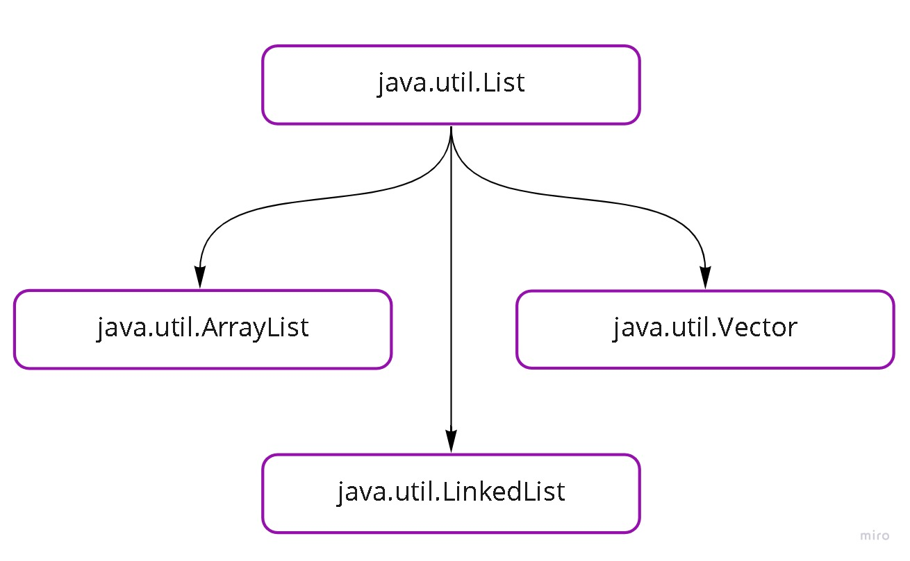

# Java e java.util: Coleções, Wrappers e Lambda expressions

> Uma lista significa, simplesmente, que estamos armazenando elementos em sequência

## Conhecendo Arrays
✅ Um array é um objeto 
✅ Um array é sempre inicializado com os valores padrões. 
✅ É uma estrutura de dados e serve para guardar elementos (valores primitivos ou referencias). 
✅ Arrays tem um tamanho fixo 
✅ Ao acessar uma posição inválida recebemos a exceção ArrayIndexOutOfBoundException

### Desvantagem do array
❌ Array não sabe quantas posições estão ocupadas (apenas tamanho total) 
❌ Array tem um tamanho fixo (não pode crescer dinamicamente) 
❌ Sintaxe fora do padrão "OO Java"

#### Forma "classica" de criar um objeto array usando a palavra chave new, exemplo:

int[] numeros = new int[2]; 
numeros[0] = 1; 
numeros[1] = 2;

#### Forma literal:
- Significa usar valores diretamente, mais direto. 
Exemplo: int[] numeros = {1,2,3,4,5};

> ##### Processo ilustrado da Classe g.TesteArrayReferencias:
> Valor padrão de uma referencia é null

## Cast explicito e implícito
    Type Cast que é nada mais do que a conversão de um tipo para outro.
### cast implícito: 
`int numero = 3;` 
`double valor = numero;` 
### cast explícito: 
`int numero = 3;` 
`double valor = (double) numero;`

### cast explicito é exigido pelo compilador
Agora, o contrário não funciona sem cast, uma vez que um double não cabe em um int: 
`double valor = 3.56;` 
`int numero = (int) valor;` 

### Cast implícito de referências
`ContaCorrente cc1 = new ContaCorrente(22, 33);` 
`Conta conta = cc1;`

### Cast explicito de referências
     cast desnecessário já que qualquer contaCorrente é uma conta:

`ContaCorrente cc1 = new ContaCorrente(22, 33);` 
`Conta conta = (Conta) cc1;` 

## ArrayList e Generics
✅ Ao adicionar o elemento sempre fica no fim da lista. 
✅ O limite do objeto do tipo java.util.ArrayList é a memória da JVM. 
✅ Guarda referências. 
✅ É do pacote java.util 
✅ Usa internamente um array

### Benefício dos Generics
✅ O código fica mais legível, já que fica explícito o tipo dos elementos. 
✅ Evitar casts excessivos porque uma vez parametrizada a lista, não precisamos mais o cast. 
✅ Antecipar problemas de casts no momento de compilação.

> Utilizar Generics é uma boa prática para nossas coleções
️

## Equals e mais listas
contains - O contains verificará se dentro daquela lista, tem o objeto passado como paramento no método
<strong>
> Equals: O método "contains" de uma lista usa o "equals" por de baixo dos panos, por isso onde se precisa fazer uma comparação customizada é importante fazer a alteração no "equals", já que o "contains" é dependende dele.
</strong> 

> O método equals, junto aos métodos toString e hashCode, é um dos métodos fundamentais da classe Object.

### Listas

> <strong> List é uma interface que define os métodos da lista, a ArrayList, LinkedList e Vector são implementações</strong>

* #### ArrayList
  > ArrayList  utiliza um array internamente com redimensionamento dinâmico.

    <strong>Pontos positivos:</strong> 
✅ Acesso fácil a qualquer elemento aleatório pelo índice 
✅ Adicionar novos elementos em um array é um processo simples  

    <strong>Pontos negativos:</strong> 
❌ A capacidade é limitada ao seu tamanho no momento da criação, ou seja, uma vez que sua capacidade acaba, é necessária a criação de um novo array, com capacidade maior, e copiar os elementos do antigo array para o novo. 
❌ Se quisermos remover um elemento, o array não permitirá que existam "buracos" em sua lista e, sendo assim, moverá todas as referências de modo que todos os índices serão modificados

    > Se for apagar elementos do arraylist o arraylist não é recomendado, por que a cada elemento que for apagado do inicio, ele tem que reorganizar tudo, agora se for somente inserir elementos e iterar ele é o tipo de lista recomendada.

 

* #### LinkedList
  > Linkedlist utiliza a estrututa de dados de uma lista duplamente encadeada

  <strong>Pontos positivos</strong> 
  ✅ Remover um elemento - pois ao remover é simplesmente informar qual será o próximo e o anterior aquele elemento.  

  <strong>Ponto negativo</strong> 
  ❌ Não conseguimos buscar diretamente um elemento aleatório pois temos que iterar desde o começo da lista até encontrar o elemento.

 

* #### Vector
  > O Vector tem uma diferença importante em relação ao ArrayList, ele é o que chamamos de thread safe.

  > Qualquer programa em Java inicia com um método main, que forma uma "pilha" e, a partir dele, podemos ter uma nova "pilha". Dessa forma, elas podem ser executadas em paralelo. Quando temos esse tipo de situação, e desejamos que as execuções sejam feitas em paralelo, em cima de uma mesma lista, utilizamos o java.util.Vector.

  > O Vector é utilizado como exceção. 
  

## ❗ Tipos de listas mais utilizadas no mercado:
* Arraylist
* set
* map

## As classes Wrappers 

> Uma coleção (ArrayList, LinkedList, Vector) somente guarda referencias e não tipos primitivos, o que acontece internamente é que ao alocar um int em uma lista, ele é transformado automaticamente em uma referencia do tipo Integer pois representa o tipo primitivo int no mundo OO. -> Esta transformação, que ocorre sempre automaticamente, é chamada de Autoboxing.

> As classes que existem para cada tipo primitivo se chamam wrappers.
> São classes que contém funcionalidades e encapsulam a variável de tipo primitivo!

* Autoboxing - Transformação de primitivo para objeto.
* Unboxing - Transformação de objeto para primitivo.

### Tipos primitivos e as classes as quais estão associadas:

   

## Ordenação de listas
* Para ordenar uma lista é preciso definir um critério de ordenação (sort)
  * Há duas formas de definir esse critério
    * Pela interface Comparator
    * Pela interface Comparable (ordem natural)
* O algoritmo de ordenação já foi implementado
  * No método sort da lista
  * No métdod sort da classe Collections
* A classe Collections é uma fachada com vários métodos auxiliares para trabalhar com as coleções, principalmente listas

## Classes anônimas e Lambdas
Quando temos uma motivação muito fraca para utilizar uma classe podemos utilizar classes anônimas. Ex: Ao utilizar uma classe somente para encapsular um método (Function Object). 
Porém para facilitar o entendimento e legibilidade do código podemos utilizar Lambdas.
