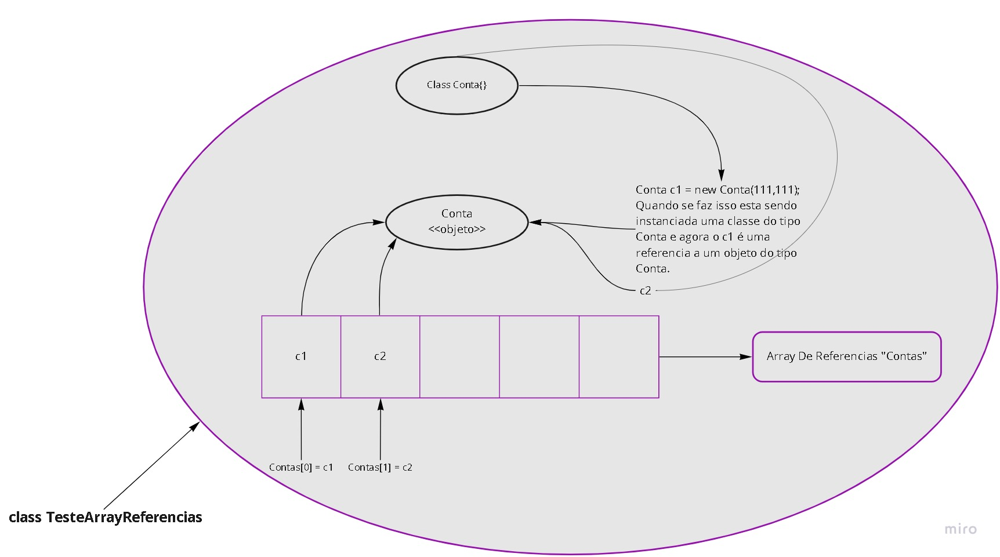

# Java e java.util: Coleções, Wrappers e Lambda expressions
## Conhecendo Arrays
-[x] Um array é um objeto
-[x] Um array é sempre inicializado com os valores padrões.
-[x] É uma estrutura de dados e serve para guardar elementos (valores primitivos ou referencias).
-[x] Arrays tem um tamanho fixo
-[x] Ao acessar uma posição inválida recebemos a exceção ArrayIndexOutOfBoundException

>Valor padrão de uma referencia é null

### Forma "classica" de criar um objeto array usando a palavra chave new, exemplo:

int[] numeros = new int[2];
numeros[0] = 1;
numeros[1] = 2;

### Forma literal:
- Significa usar valores diretamente, mais direito. 
Exemplo: int[] refs = {1,2,3,4,5};

> Processo ilustrado da Classe TesteArrayReferencias:

